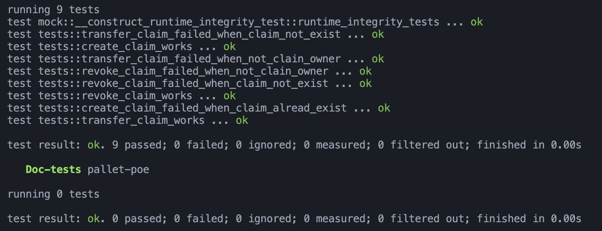

# Proof-of-Existence Pallet

**Terminal screenshot**




## 1. SCALE Codec
Substrate 使用一个轻量且高效的编解码程序来优化网络之间数据的传输。这个使用序列化和反序列化数据的程序叫做 SCALE 编解码器，SCALE是 simple concatenated aggregate little-endian 的缩写。

SCALE编解码器是 runtime 和其他节点交流的关键组件.它是为在资源受限的执行环境中（如 Substrate WebAssembly runtime）进行高效、无复制（copy-free）的数据编解码而设计。

SCALE编解码器不是自描述（self-describing）的。它假设解码时的环境包括了编码数据的所有类型知识。由 Parity 维护的前端库使用 `parity-scale-codec` ——一个由Rust实现的SCALE编解码器——来编解码 PRC 和 runtime 的交互。

SCALE 编解码器对 Substrate 和区块链有用的原因有以下几点：
- 相较于通用的序列化框架（例如 `serde`，增加了一些重要的样板文件，会使二进制文件变大）更轻量化。
- 没有使用 Rust 的 `libstd` ，因此在编译到 Wasm 的 `no_std` 环境下也可以被编译，比如 Substrate runtime。
- 它对 Rust 的支持性非常好，可以通过 `#[derive(Encode, Decode)]` 来为新类型派生编解码逻辑。

定义 Substrate 中使用的编码方案而不是重用现有的 Rust 编解码器库非常重要，因为该编解码器需要在希望支持 Substrate 区块链之间互操作性的其他平台和语言上重新实现。

下面的表格展示了Rust 实现的 Parity SCALE 编解码器对不同类型的编码。

### 不同类型的 SCALE 编解码器样例

| 类型 | 描述 | SCALE 解码值 | SCALE 编码值 |
| :---:|:--:|:---:|:---:|
|定宽整型|基本整型使用固定宽度的小端（little-endian）格式进行编码|signed 8-bit integer 69|0x45|
|||unsigned 16-bit integer 42| 0x2a00|
|||unsigned 32-bit integer 16777215|0xffffff00|
|压缩/通用整型|压缩/通用整型编码足够应对大整数（最多到$2^{536}$）并且在编码大部分值时比定宽编码更有效率（虽然对于单字节值，定宽整型永远不会更差）。|unsigned integer 0|0x00|
|||unsigned integer 1|0x04|
|||unsigned integer 42|0xa8|
|||unsigned integer 69|0x1501|
|||unsigned integer 65535|0xfeff0300|
|||BigInt(100000000000000)|0x0b00407a10f35a|
|布尔型|布尔型使用单个直接的最低有效位进行编码|false|0x00|
|||true|0x01|
|Result类型|Result是常用的一种枚举，用来指示某些操作是否成功|Ok(42)|0x002a|
|||Err(false)|0x0100|
|Option|特定类型的一个或零个值|Some|0x01 紧跟值的编码|
|||None|0x00紧跟值的编码(全0)|
|Vector(lists, series, sets)|相同类型值的编码集合。前缀是元素数量的**压缩编码**，后面依次拼接每个元素的编码|unsigned 16-bit integer vector: \[4, 8, 15, 16, 23 ,42\]|0x18 0400 0800 0f00 1000 1700 2a00|
|String|String 是字节的向量，Vec\<u8\>, u8的数值是UTF-8编码|||
|Tuple|固定大小的值的序列，每个元素可能是不同但是预先定义的固定类型。对每个元素的编码值进行拼接|(unsigned integer, boolen): (3, false)|0x0c00|
|Struct|对于结构体来说，值是被命名的，但这与编码无关（名字被无视，只有顺序会有影响）。所有容器连续的存储元素。元素的顺序不是固定的，取决于容器，并且在解码时不能依赖。这意味着将某个字节数组强制按某个顺序解码为特定struct，然后重新编码它可能会得到与之前不同的编码字节数组。|||
|Enumeration|固定数量的互斥变体，可能隐含值。编码时第一个字节用来表示变体的索引，后面的内容用来编码变体中隐含的值。因此最多支持256个变体。|enum IntOrBool {Int(u8), Bool(bool) } 中的 Int(42) 和 Bool(true)| 0x002a 和 0x0101|


**压缩/通用整型编码时，使用最低两位来表示编码模式：**
- 整数类型前标记：
	- 对参数使用压缩编码时使用 `#[pallet::compact]`
	- 对结构体内的属性使用 `#[codec(compact)]`
- `0b00` 单字节模式：上六位是值的LE编码（0-63）
	例如， unsigned integer 42 
	*mode:* 0b00
	*binary origin:* 0010 1010
	*binary add mode:* 1010 1000
	*hex:* 0xa8
- `0b01` 双字节模式：上六位和后续一个字节是值的LE编码（64 ~ $2^{14}-1$）
	例如， unsigned integer 69 
	*mode:* 0b01
	*binary origin:* 0100 0101
	*binary add mode:* 0000 0001, 0001 0101
	*hex:* 0x1501
- `0b10` 四字节模式：上六位和后续三个字节是值的LE编码（$2^{14}$ ~ $2^{30}-1$）
- `0b11` 大整数模式：上六位是后面用来编码的字节数加4，之后的字节是值的LE编码（$2^{30}-1$ ~ $2^{536}-1$）

**Result\<T, E\>编码时：**
- `0x00` 表示 Ok(v)，后面紧跟 v 的编码
- `0x01` 表示 Err(e)，后面紧跟错误信息e的编码


**Option\<T\>编码时：**
- 如果有值将保存的值编码后拼接，如 Option\<i8\>
	- `None`，0b0000 0000，0x00
	- `Some(69)`，0b0000 0001, 0100 0101，0x01 45
- 特例 Option\<bool\>
	- `None` 0x00
	- `Some(true)` 0x01
	- `Some(false)` 0x02

**Struct 编码时：**
- 属性名不会被编码到结果中
- 和元组类似，通常是各个属性的值的编码直接拼接
- 例如：
```rust
struct MyStruct{
	#[codec(compact)]
	a: u32,
	b: bool,
}

let my_struct = MyStruct {
	a: 42,
	b: true,
}
```
对应的：
	*binary:* 0010 1010, 0000 0001
	*binary add mode:* 1010 1000, 0000 0001
	*hex:* 0xa8 01

**Enumeration 编码时：**
- 可以使用  `#[codec(index="10")]` 来指定当前变体的 index 编码为 10。、


### SCALE编码的实现
-   Python: [`polkascan/py-scale-codec`](https://github.com/polkascan/py-scale-codec)
-   Golang: [`itering/scale.go`](https://github.com/itering/scale.go)
-   C: [`MatthewDarnell/cScale`](https://github.com/MatthewDarnell/cScale)
-   C++: [`soramitsu/scale-codec-cpp`](https://github.com/soramitsu/scale-codec-cpp)
-   JavaScript: [`polkadot-js/api`](https://github.com/polkadot-js/api)
-   TypeScript: [`parity-scale-codec-ts`](https://github.com/paritytech/parity-scale-codec-ts), [`scale-ts`](https://github.com/unstoppablejs/unstoppablejs/tree/main/packages/scale-ts#scale-ts)
-   AssemblyScript: [`LimeChain/as-scale-codec`](https://github.com/LimeChain/as-scale-codec)
-   Haskell: [`airalab/hs-web3`](https://github.com/airalab/hs-web3/tree/master/packages/scale)
-   Java: [`emeraldpay/polkaj`](https://github.com/emeraldpay/polkaj)
-   Ruby: [`itering/scale.rb`](https://github.com/itering/scale.rb)

